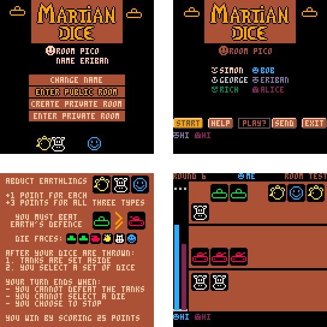
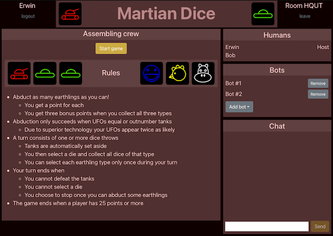

# Martian Dice

Online multi-player version of the physical dice game [Martian Dice](https://boardgamegeek.com/boardgame/99875/martian-dice).

This repository contains two different front ends:
* A [PICO-8 front end](#PICO-8-front-end) built using the PICO-8 fantasy console
* A responsive [HTML5 front end](#HTML5-front-end) built using ReactJS

Both have a completely different with Look & Feel.
They use the same backend though and are compatible; you can use either to join a given room/game.

## PICO-8 Front End

Play the game on [my website](https://erwinbonsma.nl/Games/MD-P8/index.html).

### Features

* Play against friends in a private room
* Play against other players in the public room
* Play against a Smart bot when there is nobody else
* Fancy animations
* In-game help
* Basic chat function - select messages from a pre-configured list

### Technologies

* [PICO-8](https://www.lexaloffle.com/pico-8.php)
* Javascript - to interface between PICO-8 (via GPIO) and the back end (via WebSockets)

## HTML5 Front End

### Features

* Play against other players
* Play against bots: Random, Defensive, Aggressive, and Smart
* Basic animations
* Basic sound-effects
* Responsive UI: play on phones, tablets or monitors
* Chat function
* In-game help
* Graceful disconnection handling:
	* Disconnected players can rejoin
	* Forcefully end turns of non-responsive players

### Technologies

* HTML5/CSS
* Javascript
* [ReactJS]](https://reactjs.org) + [React Bootstrap](https://react-bootstrap.github.io)

## Back End

### Technologies:

* Python
* WebSocket communication
* AWS
	* Lambda services
	* DynamDb storage
	* Deployment via CDK

## Credits

* Game Design: Scott Almes
* Coding: Erwin Bonsma
* Graphics: Erwin Bonsma
* Sound samples (all from [freesound.org](https://freesound.org)):
	* Cow ([cow.mp3](https://freesound.org/people/Benboncan/sounds/58277/)) by Benboncan
	* Chicken ([kip.mp3](https://freesound.org/people/Rudmer_Rotteveel/sounds/316920/)) by Rudmer_Rotteveel
	* Human ([huh.mp3](https://freesound.org/people/davdud101/sounds/150505/)) by davdud101
	* Ray ([ray.mp3](https://freesound.org/people/peepholecircus/sounds/171705/)) by peepholecircus
	* UFO ([ufo.mp3](https://freesound.org/people/plasterbrain/sounds/395500/)) by plasterbrain
	* Abduction ([win.mp3](https://freesound.org/people/TiesWijnen/sounds/518096/)) by TiesWijnen
	* Defeat ([die.mp3](https://freesound.org/people/josepharaoh99/sounds/364929/)) by josepharaoh99
